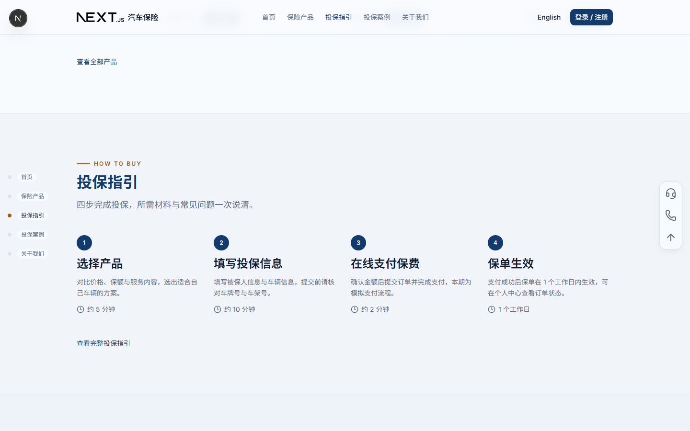
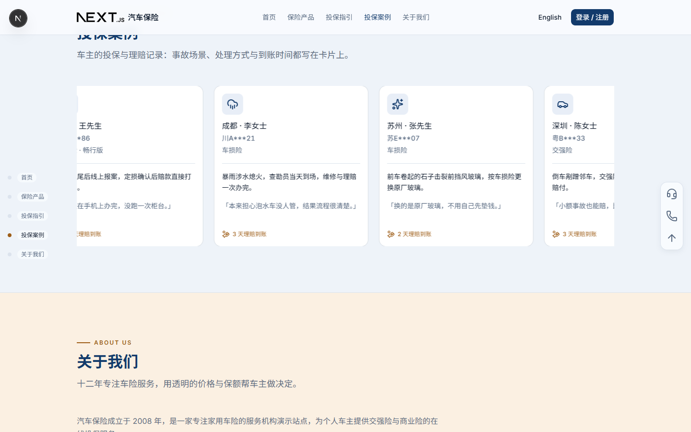
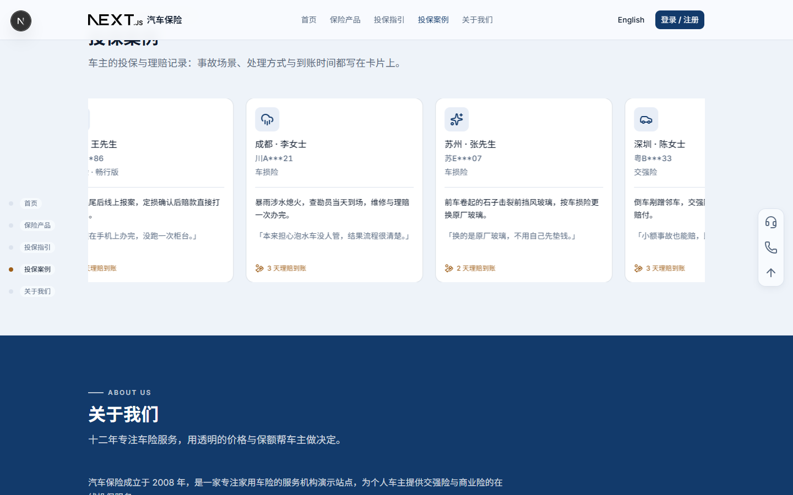

# 首页 UI 精致化 方案（待确认）

> 版本：v0.1（提案，**未实施**）
> 上游：`visual.md` v0.1、`design.md` v0.1、`avoid.md` v0.1
> 触发：用户反馈「前端 UI 样式、元素设计有些单调朴素」——要求**每栏之间加样式区分**、**标题加颜色（不要渐变色）**，参考 http://dichanhk.swiglobal.com
> 本文只出方案，**不动代码**。确认后再改代码，并把结论回写 `visual.md` / `design.md` / `avoid.md` / `page-specs.md`。

---

## 1. 现状诊断：为什么「单调朴素」

| 现象 | 代码事实 |
| --- | --- |
| 六栏看起来是一整块 | 五个分区 + 常见问题栏都是 `<section>` + `<Container className="py-16 lg:py-24">`，**没有任何底色差别**，只有垂直留白 |
| 抬头千篇一律 | 所有分区共用 `SectionHeading`：眉标 = `text-muted-foreground` 灰、标题 = `text-foreground` 近黑、副标题 = 灰；六个抬头长得一模一样 |
| 没有视觉分隔 | `avoid.md` §4 明确禁止「分区之间加分割线或色块硬切」→ 分区之间只剩留白 |
| 卡片没有层次 | 卡片靠 `border-border` 单层描边，无「图标底衬 / 发丝线 / 序号徽标」这类内部节奏 |
| 颜色几乎只有一个 | 全页除主按钮与页脚外基本是灰白；`--highlight` 暖色只在徽标与滚动轨激活点出现 |

结论：不是元素不够多，而是**缺少「分区级」的视觉节奏**（底色、边界、抬头）和**元素级的小装饰**（序号、图标底衬、发丝线）。

---

## 2. 参考站拆解（实测数据）

抓取 `http://dichanhk.swiglobal.com`（同一家 SWI 集团的地产/楼宇保险站），实测值如下：

### 2.1 分区底色明暗交替（关键手法）

按出现顺序读取各 `<section>` 的 `background-color`：

| 顺序 | 分区 | 实测底色 |
| --- | --- | --- |
| 1 | hero | `rgb(6,60,51)` 深绿 |
| 2 | esg-section | `rgb(250,249,246)` 暖白 |
| 3 | esg-module | `rgb(250,249,246)` |
| 4 | coverage-detail | 透明（继承暖白） |
| 5 | industry | 透明 |
| 6 | process-detail | `rgb(248,246,240)` 暖白（更暖一档） |
| 7 | company-showcase | `rgb(255,253,248)` 近白 |
| 8 | recognition | `rgb(11,22,40)` **深navy** |
| 9 | about | `rgb(250,249,246)` |
| 10 | home-cta | `rgb(7,63,53)` **深绿通栏** |
| 11 | faq | 透明（继承） |

→ 手法：**底色在 3 档暖白之间来回 + 中间插一条深色带**，不需要分割线就分出了「栏」。

### 2.2 抬头与颜色

| 元素 | 实测 |
| --- | --- |
| 分区眉标 | 13px / 700 / `rgb(179,134,62)` **金色** / 字距 1.56px |
| 大标题 | `Georgia, "Noto Serif TC", serif` 衬线 / 40px / 500 / `rgb(23,63,57)` / 字距 0.8px |
| 正文 | `Arial, "Noto Sans TC"` 无衬线 / `rgb(18,61,54)` |
| 主 CTA 按钮 | 金色底 `rgb(194,148,66)` / 白字 / **圆角 0**（方角） |
| 常见问题行 | 上下 1px 发丝线、金色 `+ / −`、行高大、问题左对齐 |
| 投保流程 | 深色实心**圆形序号**（1/2/3）+ 线性图标 + 标题 + 说明，列间 1px 竖线 |

→ 关键可借用的三点：**① 眉标换色；② 标题用衬线；③ 深色圆形序号 + 列间竖线。**

### 2.3 我们不照搬的部分

- 参考站是深绿 + 金，我们是深蓝 + 暖棕（`--primary #123A6B` / `--highlight #9E5E18`），**只借节奏与结构，不换色相**。
- 参考站标题用衬线字体，我们 `design.md` §3.1 定的是无衬线（Inter / Noto Sans SC）→ 见 §7 决策点 D1。
- 参考站大量使用暖白底（近 100% 面积是暖色系）→ 与 `design.md` §2.2「暖色总占比 < 10%」冲突，见决策点 D2。

---

## 3. 方案总览

四个改动方向，彼此独立，可分批实施：

| # | 方向 | 影响面 | 收益 |
| --- | --- | --- | --- |
| A | **分区底色节奏**（六栏明暗交替 + 浅色带之间 1px 发丝线） | `page.tsx` + 各 Section 组件 | 最大：一眼看出「一栏一栏」 |
| B | **分区抬头换色**（眉标暖色 + 前置短横、标题换主色） | `SectionHeading` 一处，全站生效 | 大：标题不再是清一色近黑 |
| C | **元素级小装饰**（序号徽标、列间竖线、卡片发丝线、FAQ 行线、图标底衬） | `StepList` / `CaseCard` / `ProductCard` / `FaqAccordion` | 中：去掉「平」的感觉 |
| D | **深色带锚点**（「关于我们」改深蓝底反白） | `AboutSection` + 对比度实测 | 中：参考站最强的记忆点 |

---

## 4. 方案 A：分区底色节奏（建议全做）

### 4.1 节奏表

| 顺序 | 分区 | 底色 | 文字 |
| --- | --- | --- | --- |
| 1 | 首页 Hero | 深蓝视频 + 径向遮罩（现状） | `primary-foreground` |
| 2 | 保险产品 | `bg-background` `#F8FBFE` | 默认 |
| 3 | 投保指引 | `bg-muted` `#F1F5FA` | 默认 |
| 4 | 投保案例 | `bg-secondary/65`（与背景混合，约 `#EDF2F9`） | 默认 |
| 5 | 关于我们 | **方案 A1**：`bg-highlight-soft` `#FBF0E2`（暖米） **方案 A2**：`bg-primary` `#123A6B`（深蓝反白，见方案 D） | A1 默认 / A2 `primary-foreground` |
| 6 | 常见问题 | `bg-background` | 默认 |
| 7 | 页脚 | `bg-primary`（现状） | `primary-foreground` |

### 4.2 边界处理

- **浅 → 浅**（2→3→4、5→6）：加 `border-t border-border`（1px 通栏发丝线），补足浅色档位之间 ΔL 偏小的问题。
- **浅 → 深**（Hero 之后、进入页脚）：底色差已经足够，**不加线**。

### 4.3 会让「栏」消失的两个坑

- 底色必须打在 `<section>` 上（通栏），不能打在 `Container` 上，否则左右留白仍在冷白底上，看起来像「贴了一块色纸」。
- 相邻两栏不能选同一档底色，否则加了分隔线也像同一栏。

---

## 5. 方案 B：分区抬头换色（建议全做）

在 `SectionHeading` 一处改，六个分区与各内容页同时生效（沿用「抬头只有一套模版」的既有纪律）。

| 部位 | 现状 | 方案 |
| --- | --- | --- |
| 眉标 | `text-muted-foreground`（灰） | `text-highlight`（暖棕 `#9E5E18`） |
| 眉标装饰 | 无 | 前置 28×2px 同色短横（`::before`），与参考站的金色短线同构 |
| 大标题 | `text-foreground`（近黑 `#0F1B2D`） | `text-primary`（深海军蓝 `#123A6B`） |
| 标题第二行 | `titleAccent` → `text-primary`（已有能力，首页未启用） | 内容页长标题启用，第二行换主色 |
| 副标题 | `text-muted-foreground` | 不变 |
| 深色带上 | — | 眉标换 `primary-foreground/70`，短横用 `currentColor` |

**明确不做**：`bg-clip-text` + 渐变文字、彩色发光、描边字。标题的「颜色」只来自**单一纯色 + 明度差**（`avoid.md` §1 仍生效）。

---

## 6. 方案 C：元素级小装饰（建议全做）

| 组件 | 现状 | 方案 |
| --- | --- | --- |
| `StepList`（投保指引 4 步） | 序号是描边圆 | 序号改 `bg-primary` 实心圆形徽标（白字）；桌面端列间加 1px `border-border` 竖线（移动端不加） |
| `CaseCard`（投保案例） | 单层描边 | `border-border` + `shadow-xs`；悬停升到 `shadow-sm`；卡片内「车牌/险种」与「事故经过」之间加发丝线 |
| `ProductCard`（保险产品） | 类别图标无底 | 图标加 `bg-secondary` 圆角方块底；价格行与服务内容之间加 1px 发丝线 |
| `FaqAccordion`（常见问题） | shadcn 默认（每项下边框） | 抬头居中；行上下通栏发丝线；`+ / −` 图标用 `text-highlight`；行内边距加大到 20px |
| `StatBlock`（关于我们 4 项数据） | 平铺 | 桌面 2×2 / 4×1 网格，数字 `text-primary` + `tabular-nums`，格间加发丝线 |
| 页脚 | 深蓝 | 不变（本身已是深色锚点） |

---

## 7. 方案 D：深色带锚点（可选）

把「关于我们」整栏换成 `bg-primary` 深蓝底、文字反白——对应参考站的 `recognition-module`（`rgb(11,22,40)`）。

- 收益：整页从「一条浅色带到底」变成「深—浅—浅—浅—**深**—浅—深」的节奏，记忆点最强。
- 代价：`AboutSection` 内所有元素都要换色（段落、`StatBlock` 数字与标签、「了解我们」链接），并重跑对比度实测。
- 位置优势：第 5 栏深蓝 + 第 7 栏页脚深蓝，中间隔着第 6 栏浅色常见问题，不会连成一片。

---

## 8. 与现有规范的冲突（必须同步修改的文档）

| 文档 | 现有条款 | 需要改成 |
| --- | --- | --- |
| `avoid.md` §4 | 「**分区之间加分割线或色块硬切**：分区靠垂直留白切换」 | 「相邻分区必须有底色区分；浅色档位之间可用 1px 发丝线；禁止高对比撞色与厚重分割线（>1px、双线、阴影分隔）」 |
| `visual.md` §6 | 「分区之间靠留白切分」 | 同步为「底色节奏 + 留白」 |
| `design.md` §4.2 | 分区节奏表只有内边距 | 增加「分区底色节奏表」（§4.1 的表）与「抬头配色表」（§5 的表） |
| `design.md` §2.2 | 「暖色只有这一组，总占比 < 10%，只出现在小面积元素上」 | 若采用 A1（暖米色带）需放宽为「暖色可用于分区底色与眉标；不用于正文与大面积按钮」 |
| `design.md` §2.4 | 对比度验收表 | 新增各分区底色上的 `muted-foreground` / `primary` 组合实测值 |
| `page-specs.md` §3.1 | 首页结构树 | 六个分区各补一行底色 |

---

## 9. 需要确认的 3 个决策点

| # | 问题 | 选项 | 影响 |
| --- | --- | --- | --- |
| D1 | 标题是否引入**衬线字体**（参考站用 Georgia / Noto Serif TC）？ | (a) 保持无衬线（现状，零风险） (b) 只给 `h1`/`h2` 上 `Noto Serif SC`，正文仍无衬线 | 选 (b) 需新增字体依赖（`next/font` 下载 Noto Serif SC 子集）；视觉差异最大，也最像「有牌照的老牌保险公司」 |
| D2 | 「关于我们」用什么底？ | (a) 暖米 `highlight-soft`（A1，温和，但突破暖色 <10%） (b) 深蓝 `primary` 反白（A2/方案 D，冲击力最强） (c) 冷蓝 `secondary`（最保守，但不显眼） | 决定整页节奏的「锚点」在哪 |
| D3 | 是否在「常见问题」之前加一条**「立即投保」深蓝 CTA 通栏**（参考站的 `home-cta`）？ | (a) 加 (b) 不加 | 加了会多一个分区级行动点；`avoid.md` §2「分区级主行动点每屏最多一个」不受影响（不同屏） |

---

## 10. 工作量与验收

**改动文件**（预估）：`components/blocks/section-heading.tsx`、`components/blocks/step-list.tsx`、`components/blocks/faq-accordion.tsx`、`components/blocks/case-card.tsx`、`components/blocks/product-card.tsx`、`components/blocks/stat-block.tsx`、`components/sections/about-section.tsx`、`components/sections/*.tsx`（底色）、`app/globals.css`（如需新令牌）、`lib/i18n/dictionaries/*.json`（如启用标题第二行配色）。

**验收方式**：

1. 逐分区桌面 / 移动截图，肉眼确认相邻两栏底色可区分。
2. 每个新底色上重跑对比度实测：`muted-foreground` / 新底、`primary` / 新底、`highlight` / 新底，**任一 < 4.5:1 即不合格**。
3. 360px 宽度无横向滚动条；ScrollRail 与悬浮工具轨不出现。
4. 切换 `zh` / `en` 后无残留文案。

---

## 11. 预览

预览用「在真实首页上注入样式」的方式生成（**未改任何代码**）：在 Playwright 里加载 `http://localhost:3000/zh`，注入一份覆盖样式后截图。预览中眉标已换成暖棕 + 前置短横、标题已换成主色、浅色带之间已加 1px 发丝线。

**投保指引栏（冷灰蓝底）+ 抬头换色 + 序号徽标**

**方案 A1：「关于我们」用暖米底**

**方案 A2 / D：「关于我们」用深蓝反白底**

